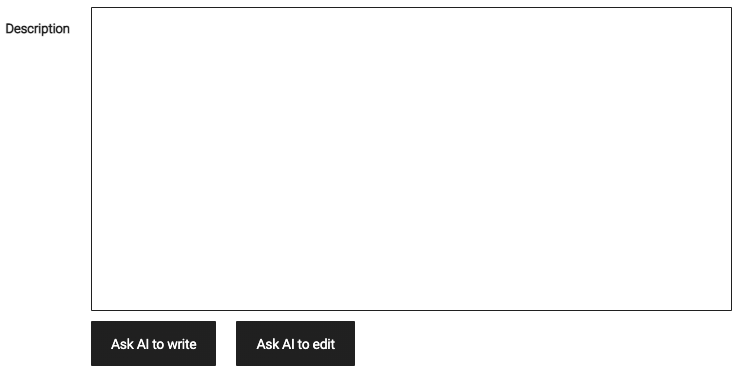
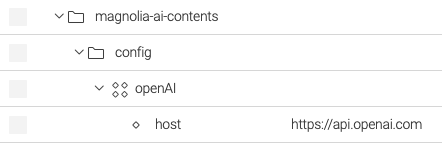
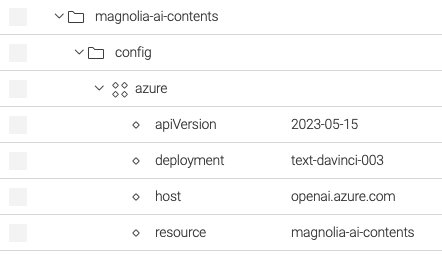
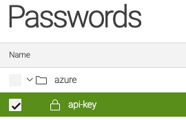
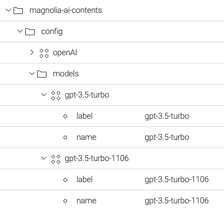
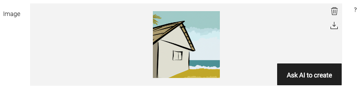

OJO: el property "performance" ha sido sustituido por "model" y "words" es un comodín del template

# Magnolia AI Contents
Module of [Magnolia CMS](https://www.magnolia-cms.com/) that adds the following features to create contents using [Large language models](https://en.wikipedia.org/wiki/Large_language_model) like [GPT](https://en.wikipedia.org/wiki/Generative_pre-trained_transformer) from [Open AI](https://openai.com/).

## Features
- Integration with [OpenAI](https://platform.openai.com/docs/api-reference) and [Azure OpenAI](https://azure.microsoft.com/products/cognitive-services/openai-service/)
- Field `textFieldAI` to create and edit text contents using AI.
- Prompt generator to create prompts from existing contents.
- UI field `imageAI` to create images using AI.

## Usage
### Field _textFieldAI_
Text field whose content can be created from existing contents using AI.



Definition of field _textFieldAI_

```yaml
textFieldUsingAI:
  $type: textFieldAI
  strategy: completion
  model: gpt-3.5-turbo
  words: 300
  promptGenerator:
    template: ai.prompt.template.hotels-app.description
    properties:
      title:
        name: title
      category:
        targetWorkspace: category
        targetPropertyName: displayName
      rooms:
        name: rooms
      country:
        name: country
      city:
        name: city
```
### Field properties

#### Field-specific properties
<table>
<tr><th>Property</th><th>Description</th></tr>
<tr>
<td><code>strategy</code></td>
<td>
<strong>Required</strong>

Specifies the completion strategy to create the text.

- `completion` to write the text from a given prompt.
- `edit` to edit the current text from instructions -e.g. "Translate the following from slang to a business letter" -.
</td>
</tr>
<tr>
<td><code>model</code></td>
<td>
<i>Optional</i>

AI model used to create text, it can be a general purpose model like `gpt-3.5-turbo` or a fine-tuned model trained with contentes from Magnolia.
</td>
</tr>
<tr>
<td><code>words</code></td>
<td>
<i>Optional</i>

Number of words of the generated text.

The value of `words` is used to build the prompt. See `promptGenerator` to know how to make it.
</td>
</tr>
<tr>
<td><code>promptGenerator</code></td>
<td>
<i>Optional</i>

Prompt template and fields of the form that will be used to build the prompt used by AI to generate the text.

<strong>properties</strong>

List of fields in the form whose value will appear in the prompt. In case of `link fields`, specify the target `workspace` and `property` name (prompt generator will take the value of this property)

<strong>template</strong>

Name of the copy that contains the template of the prompt.

The copy can include the following tokens:

- Value of fields specified by `promptGenerator.properties`
- Current language
- Number of words specified by `words`

Example of prompt template

<code>Write a product description based on the information provided in the technical specifications delimited by triple backticks.\n\nUse {1} as language.\n\nUse at most {2} words.\n\nTechnical specifications: ```{0}```</code>
</td>
</tr>
</table>

#### Common text field properties
This field extends [Text field](https://docs.magnolia-cms.com/product-docs/6.2/Developing/Templating/Dialog-definition/Field-definition/List-of-fields/Text-field.html) and it is possible to specify any property from this field.

## Setup
1. Add maven dependency to your bundle of Magnolia
```xml
<dependencies>
    <dependency>
        <groupId>org.formentor</groupId>
        <artifactId>magnolia-ai-contents</artifactId>
        <version>0.0.1</version>
    </dependency>
</dependencies>
```
```xml
repository github
```
2. Activate and configure [Open AI](https://openai.com/) or [Azure OpenAI](https://azure.microsoft.com/products/cognitive-services/openai-service/)  

#### OpenAI
- Specify the host of the API of OpenAI in the configuration of the module.

`config:/magnolia-ai-contents/openAI` 



- Specify the `API key` of OpenAI in the secret named `openai/api-key` of [Password Manager](https://docs.magnolia-cms.com/product-docs/6.2/Modules/List-of-modules/Password-Manager-module.html).


#### Azure OpenAI
- Specify `apiVersion`, `deployment`, `host` and `resource` in configuration of the module.

`config:/magnolia-ai-contents/azure`



- Specify the `API key` in the secret named `azure/api-key` of [Password Manager](https://docs.magnolia-cms.com/product-docs/6.2/Modules/List-of-modules/Password-Manager-module.html).



3. Specify the models available to create texts. It can be general purpose models - see https://platform.openai.com/docs/models - or fine-tuned models.



### Field _imageAI_
Creates image content from a given prompt.



Definition of field _imageAI_

```yaml
imageAI:
  $type: imageAI
```
### Example
```yaml
subApps:
  detail:
    label: Blog
    form:
      properties:
        imageAI:
          $type: compositeField
          label: Image AI
          itemProvider:
            $type: jcrChildNodeProvider
            nodeName: jcr:content
            nodeType: mgnl:resource
          properties:
            image:
              label: ""
              $type: imageAI
```
